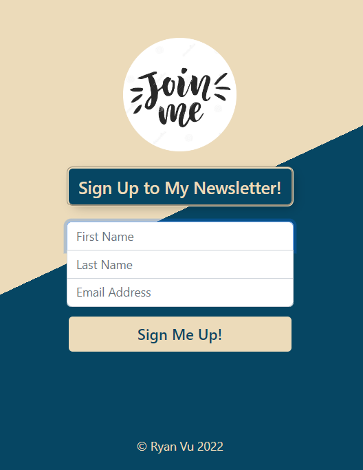

# newsletter

Live Version: https://ryan-newsletter.herokuapp.com/  
This newsletter app is built using:  
- HTML, CSS, Bootstrap (frontend)  
- Node, Express (backend)  
- MailChimp (database)
- Heroku (deployment)

In the project directory, you can run: **_npm install_**

Runs the app in the development mode.  
Open http://localhost:3000 to view it in the browser.

  
