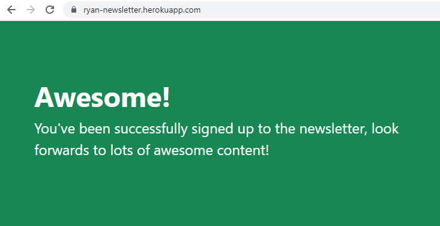
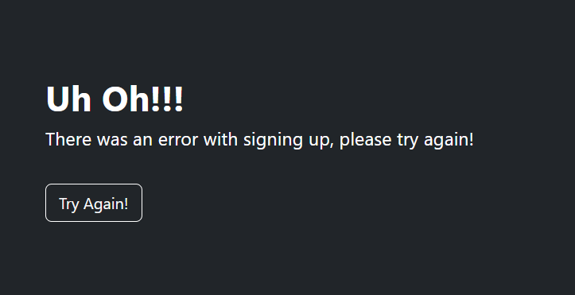

# newsletter-signup

Live Version: https://ryan-newsletter.herokuapp.com/  
This newsletter app is built using HTML, CSS, Bootstrap, NodeJS, ExpressJS, MailChimp and is deployed using Heroku.  
List of people who signed up will be stored on MailChimp.

In the project directory, you can run: **_npm install_**

Runs the app in the development mode.  
Open http://localhost:3000 to view it in the browser.

  
Sign up page - Main page

  
When user sign up successfully

  
When there is something wrong with the sign up process.
